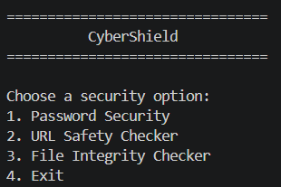
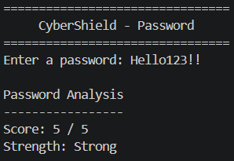
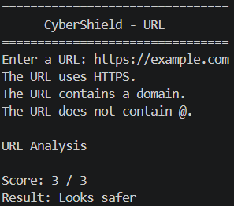
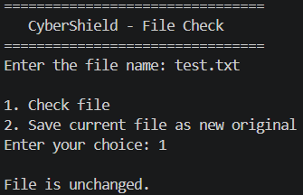
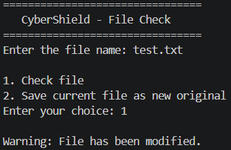

# CyberShield

### Overview of the Project

CyberShield is a basic python application built using basic cybersecurity assessments.

This application was built to check the strength of passwords, identify common signs of URLs, and ascertain whether a file has been tampered with.

It is built using basic Python and, therefore, good for learning about both Python and cybersecurity..

## Features

### 1. Password Security

The password checker checks a password for:

* Minimum 8 characters
* Uppercase letters
* Lowercase letters
* Numbers
* Special characters

Based on these checks, it provides a rating out of 5 and highlights the password strength to be **Weak, Medium, or Strong**.

### 2. URL Safety Checker

The URL checker checks a few basic things in a URL:

* Whether it uses HTTPS
* Whether a domain is present
* Whether the URL contains `@`
* Whether it contains some words that may be suspicious

It then gives a basic result based on these checks

### 3. File Integrity Checker

The file integrity checker makes use of **SHA-256 hash** algorithm.

First, the hash of the original file is created and stored into `original_hash.txt`. The next time the file is checked, a comparison of its hash with the original hash takes place.

In case they match, the file remains unmodified. If they differ, the program produces an alert message indicating that the file was changed.

## 4. Technologies/Tools Used

* Python
* Visual Studio Code
* `hashlib`
* `os`

## Steps to Install and Run the Project

1. Install Python.
2. Install Visual Studio Code.
3. Open the `CyberShield` folder in VS Code.
4. Make sure the Python files are inside the project folder.
5. Open `main.py`.
6. Run `main.py`.
7. Select an option from the menu.
8. Follow the instructions shown in the terminal.

## 6. Instructions for Testing

### Password Security

Run the program and select **1**.

Enter a sample password such as:

`Hello123!`

The program should show the score and password strength.

### URL Safety Checker

Run the program and select **2**.

For example, enter:

`https://example.com`

The program will check the URL and show the result.

### File Integrity Checker

Run the program and select **3**.

Enter:

`original_hash.txt`

Choose **1** to save the current file as the original file.

Then choose **2** without changing the file. It should display:

`File is unchanged.`

After that, make a small change to `original_hash.txt`, save it, and choose **2** again.

This time it should display:

`Warning: File has been modified.`

## Screenshots

The following screenshots show the project working:

### Main Menu

### Password Checker

### URL Safety Checker

### File Unchanged

### File Modified

## Project Structure

CyberShield
├── main.py
├── password_checker.py
├── url_checker.py
├── file_checker.py
├── statement.md
├── README.md
└── screenshots
    ├── main_menu.png
    ├── password_output.png
    ├── url_output.png
    ├── file_unchanged.png
    └── file_modified.png
